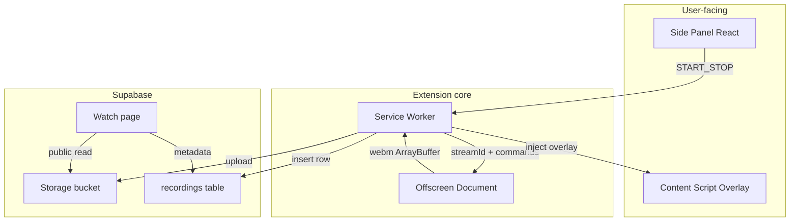

# Reel — Reasoning Document

## 1. Problem statement

Loom proved that **async video messaging** wins when capture → share is frictionless. For a 2-day take-home, success means:

| Metric | Target |
|--------|--------|
| Time to first recording | &lt; 10 seconds after install |
| Clicks to start (tab) | 1 click from side panel |
| Feedback after stop | Instant local preview (no upload wait) |
| Clicks to share | 1 click “Copy link” when upload completes |

**Reel** optimizes that path—not feature parity with Loom’s platform (teams, analytics, editor, SSO).

---

## 2. Competitive UX: Loom vs Reel

### What Loom does well

- Reliable capture pipeline and brand trust
- Hosted links, comments, workspace features
- Familiar countdown + control chrome

### Pain points addressed in Reel

| Loom-like friction | Reel approach |
|--------------------|---------------|
| Popup feels cramped | **Side panel** as primary surface |
| Unclear capture target | Explicit **Tab / Window / Screen** cards |
| Share link waits on upload | **Preview first**, upload async with progress |
| Controls easy to lose | **Floating pill** on the captured tab (timer, pause, stop) |
| Extra account steps early | **Session UUID** in `chrome.storage`—no signup for MVP |

### Out-of-the-box differentiator (15%)

- **`Alt+Shift+R`** — record current tab without hunting the panel
- **Auto-title** from `document.title` stored in Supabase for the watch page

---

## 3. Architecture

### Why offscreen?

MV3 **service workers cannot use `MediaRecorder` or canvas**. Chrome’s recommended pattern is an **offscreen document** with `USER_MEDIA` + `DISPLAY_MEDIA` reasons. All encoding happens there; the background orchestrates permissions and upload.

### Why side panel?

Side panel stays open during recording, fits **mode toggles + library + preview**, and avoids popup dismissal. `openPanelOnActionClick` maps toolbar icon → panel.

### Why content script overlay?

- **Tab capture** includes injected DOM → webcam **bubble** and **controls** appear in the final video without canvas compositing.
- **Countdown** overlay is visible on the page being recorded.

### Capture strategy

| Mode | API |
|------|-----|
| Tab | `chrome.tabCapture.getMediaStreamId` → offscreen `getUserMedia` (`chromeMediaSource: tab`) |
| Window / Screen | `chrome.desktopCapture.chooseDesktopMedia` → offscreen `getUserMedia` (`chromeMediaSource: desktop`) |

Mic is merged as an extra audio track before `MediaRecorder.start()`.

---

## 4. Scope cuts (2-day constraint)

**Shipped**

- Tab / window / screen recording
- Pause / resume / stop
- Local preview + library (last 5)
- Supabase upload + public watch page
- Extension zip + docs

**Deferred (documented)**

- Accounts / OAuth, teams, comments
- In-browser trim editor
- Signed URLs / private links
- Webcam compositing for **window/screen** (bubble is tab-only)
- Firefox (Chrome MV3 APIs only)

---

## 5. Supabase security posture (take-home)

**Current (demo-friendly)**

- Anon key in extension (standard for client-only demos)
- Public read on `recordings` table and storage bucket
- Inserts allowed for anon (RLS policies in migrations)

**Risks**

- Anyone with anon key could upload if they extract it from the extension
- Public bucket = link-guessable if UUIDs leak

**Production mitigations**

- Edge Function upload with auth, rate limits, virus scan
- Signed URLs with TTL instead of public bucket
- Max file size + duration server-side
- Per-user auth (Supabase Auth) and row-level ownership

---

## 6. AI tool usage

| Area | AI-assisted | Human-owned |
|------|-------------|-------------|
| WXT scaffold, Tailwind layout | Yes | Reviewed structure |
| Supabase SQL boilerplate | Yes | RLS intent verified |
| Offscreen + capture pipeline | Partial | Message protocol, stream merge, desktop vs tab |
| Background state machine | Partial | Countdown, upload retry UX |
| REASONING / README | Drafted with AI | Edited for accuracy |

Critical path (**MediaRecorder in offscreen**, **streamId handoff**, **desktopCapture picker**) was implemented and validated against Chrome MV3 constraints—not pasted blindly.

---

## 7. Known limitations

- **`chrome://` and Chrome Web Store** pages cannot be captured (Chrome restriction).
- **Large recordings** may hit `chrome.storage` limits if kept as base64; MVP caps library at 5 items.
- **Window/screen + webcam bubble** not composited into video (tab mode only).
- **Supabase required** for share links; download always works locally.
- **displaySurface** fallback via `getDisplayMedia` only if `streamId` path fails.

---

## 8. Next steps (if extended)

1. Server-side upload via Edge Function + auth
2. Canvas compositing for webcam on all modes
3. Trim UI (start/end sliders) before upload
4. WebM → MP4 transcode for Safari playback on watch page
5. Chrome Web Store listing + privacy policy

---

## 9. Rubric mapping

| Weight | How Reel addresses it |
|--------|---------------------|
| 30% Clarity | This document + README + demo script |
| 30% UI/UX | Side panel, floating controls, countdown, instant preview |
| 25% Code quality | Typed messaging, separated lib/, WXT MV3 patterns |
| 15% Out of the box | Keyboard shortcut + auto-title on share page |
