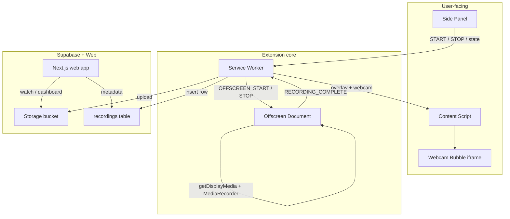

# Reel — Reasoning Document

Design decisions, tradeoffs, and architecture for the Reel screen recorder (Loom-style take-home).

---

## 1. Problem statement

Loom wins on **time-to-share**: open recorder → capture → link. Reel targets the same loop with a Chrome extension + hosted watch page.

| Goal | Target |
|------|--------|
| Time to first recording | < 10 s after install |
| Clicks to start | 1 click + Chrome picker |
| Feedback after stop | Instant local preview |
| Clicks to share | 1 click “Copy link” |

Reel is not aiming for Loom’s full platform (teams, analytics, editor, SSO).

---

## 2. UX choices vs Loom

| Friction | Reel approach |
|----------|---------------|
| Cramped popup | **Side panel** as primary UI |
| Unclear capture target | Single **Record** button → Chrome’s native picker (tab / window / screen) |
| Waiting on upload to preview | **Preview first**, upload async with progress |
| Lost controls while recording | **Floating pill** on the active tab (timer, pause, stop) |
| Forced signup | **Guest recording** with anonymous session; sign-in optional for dashboard |

**Differentiators**

- `Alt+Shift+R` — quick access to the same record flow
- Auto-title from page metadata for watch page headings
- Tab/window pick **auto-focuses** the captured surface (`CaptureController`)

---

## 3. Architecture

### Why an offscreen document?

MV3 **service workers cannot run `MediaRecorder` or hold `MediaStream`**. Chrome recommends an **offscreen document** with `USER_MEDIA` + `DISPLAY_MEDIA` reasons.

Recording lives in offscreen so **stop works even when the side panel is closed** — the background sends `OFFSCREEN_STOP` to a persistent recorder, not to a UI that may be suspended.

### Why record the display stream directly (no canvas pump)?

Early versions re-encoded capture through a hidden `<canvas>` in offscreen to work around frozen tab streams. In practice, offscreen canvas drawing was **throttled**, producing **0 video frames** for long recordings (timer ran, blob ~13 KB, 1 chunk).

**Current approach:** pass the `getDisplayMedia` stream straight to `MediaRecorder`. This matches what worked reliably in the side panel and fixes “No video data captured after 70s” failures.

### Why the side panel?

- Stays open during recording (mode toggles, timer, preview, library)
- Toolbar icon → panel via `openPanelOnActionClick`
- User gesture for starting capture originates here (`Record` click → background → offscreen picker)

### Why a content script overlay?

- **Pause / stop** on whatever tab is active (important for **Entire screen** mode)
- **Webcam bubble** injected as an extension iframe on the page (camera permission in extension context, not per-site Gmail blocks)
- Overlay **moves with the active tab** during full-screen recordings

### Capture flow (current)

1. User clicks **Record** in side panel.
2. Background creates offscreen doc (if needed) and sends `OFFSCREEN_START`.
3. Offscreen calls `getDisplayMedia` with `CaptureController.setFocusBehavior('focus-captured-surface')` so **tab/window picks focus that surface**.
4. Background places overlay on the focused tab; optional webcam bubble on that tab.
5. `MediaRecorder` writes WebM chunks in offscreen.
6. **Stop** (floating bar, panel, or Chrome “Stop sharing”) → `OFFSCREEN_STOP` → finalize blob → local preview → Supabase upload.

| Picker choice | Behavior |
|---------------|----------|
| Entire screen | Capture all monitors; overlay follows active Chrome tab |
| Window | Focuses chosen window; overlay on its active tab |
| Tab | Focuses chosen tab; overlay on that tab |

Legacy `tabCapture` / `desktopCapture` + streamId paths remain in the codebase for compatibility but **picker + offscreen `getDisplayMedia`** is the primary path.

---

## 4. Webcam bubble

**Problem:** Per-tab `getUserMedia` on content sites fails when the site blocks camera (e.g. Gmail) and prompts every tab switch.

**Approach:**

1. Optional toggle in side panel.
2. Extension page (`webcam-bubble.html`) embedded in a **floating iframe** on the active tab.
3. Camera permission requested once in **extension origin**.
4. Attempt **Picture-in-Picture** inside the bubble page when Chrome supports it (stays visible across tabs).

**Tradeoff:** A true OS-level always-on-top bubble (like Loom desktop) is **not possible** in a browser extension. PiP + in-page iframe is the closest Chrome allows.

**Not in scope:** Compositing webcam into the video file for window/screen modes (would require canvas compositing in offscreen — reintroduces encoding risk).

---

## 5. Stop / cleanup

Stop must:

1. Flush `MediaRecorder` chunks
2. **Stop all capture tracks** → dismiss Chrome **“Stop sharing”** UI
3. Hide overlay + webcam
4. Move side panel to **preview**

Chrome’s native **Stop sharing** ends the display track; we treat that as a valid stop and save the recording if enough data was captured (not only an error).

---

## 6. Web app (`web/`)

Next.js app replaces a legacy Vite share page.

| Route | Role |
|-------|------|
| `/watch/[id]` | Public player; reads Supabase metadata + storage URL |
| `/login` | Email/password auth; `?ext=1` posts session to extension |
| `/dashboard` | Signed-in library with previews |

Middleware protects routes; guest uploads use anonymous `session_id` in Postgres.

---

## 7. Supabase security (take-home vs production)

**Current (demo-friendly)**

- Anon key in extension (normal for client demos)
- Public read on `recordings` + public storage bucket
- Guest insert via RLS; authenticated users own rows after `004_auth_users.sql`

**Risks**

- Extracted anon key → upload spam
- Public bucket → anyone with link can view

**Production mitigations**

- Edge Function upload with auth + rate limits
- Signed URLs with TTL
- Max duration / file size server-side
- Per-user quotas

---

## 8. Scope: shipped vs deferred

**Shipped**

- Tab / window / entire screen via Chrome picker
- Pause / resume / stop (panel + floating bar + Chrome stop sharing)
- Local preview + recent library
- Supabase upload + watch page + optional dashboard auth
- Guest + signed-in flows

**Deferred**

- In-browser trim editor
- Webcam burned into video for all modes
- Private / signed links
- Firefox (Chrome MV3 APIs)
- Teams, comments, analytics

---

## 9. Known limitations

- `chrome://`, Web Store, and extension pages cannot be recorded (Chrome policy).
- Very long recordings may stress local IndexedDB blob storage; library capped informally.
- Webcam bubble is visual overlay only — not composited into window/screen recordings.
- Safari may not play WebM on all devices; transcode would be a future step.
- Dev: stale Next.js `.next` cache can cause Supabase vendor chunk errors — delete `.next` and restart.

---

## 10. AI tool usage

| Area | AI-assisted | Human-reviewed |
|------|-------------|----------------|
| WXT / Tailwind scaffold | Yes | Structure verified |
| Supabase SQL | Yes | RLS intent checked |
| Offscreen capture pipeline | Partial | Direct-stream fix after canvas failure |
| Stop / focus / webcam iterations | Partial | Tested in Chrome |
| README / REASONING | Drafted with AI | Updated for current behavior |

Critical paths (**offscreen MediaRecorder**, **stop when panel closed**, **direct stream encoding**) were validated in Chrome, not pasted blindly.

---

## 11. If we had more time

1. Edge Function upload + auth hardening
2. Optional canvas compositing for webcam-in-video (with offscreen frame guarantees)
3. Trim UI before upload
4. WebM → MP4 for Safari watch page
5. Chrome Web Store listing + privacy policy

---

## 12. Rubric mapping

| Weight | How Reel addresses it |
|--------|----------------------|
| 30% Clarity | README install/usage + this document |
| 30% UI/UX | Side panel, floating controls, instant preview, guest-first |
| 25% Code quality | Typed messaging, lib separation, WXT MV3 patterns |
| 15% Out of the box | Shortcut, auto-focus on pick, auto-title on watch page |
